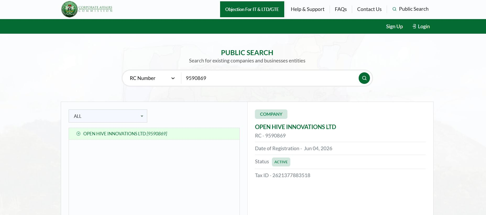
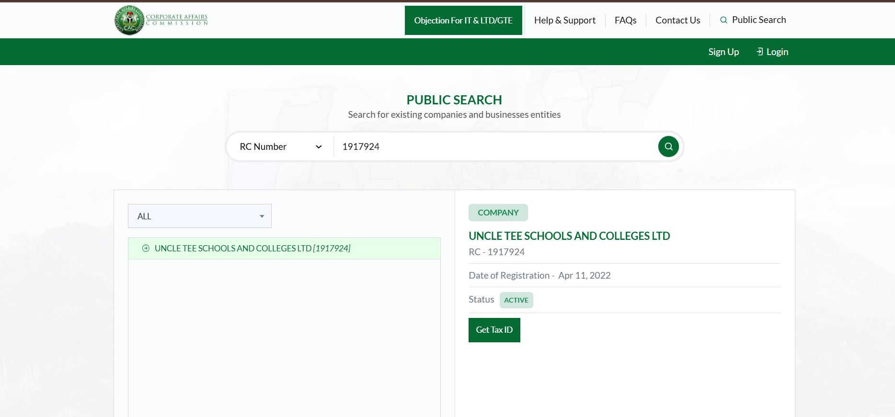

# FlowFi BTC — Pilot Readiness

## Objective

FlowFi's MVP is designed to complete a single end-to-end receivable financing cycle using sBTC.

The pilot scope is intentionally limited to:

- One receivable
- One business participant
- One capital provider
- One funding transaction
- One repayment event

This document exists to show reviewers that Milestone 3 outreach is already underway, not deferred until after funding arrives.

---

## Business Outreach

### Primary: Open Hive Innovations Ltd

- **Registration:** RC-9590869, verifiable at [https://icrp.cac.gov.ng/public-search](https://icrp.cac.gov.ng/public-search)
- **How outreach happened:** Initial contact via WhatsApp, followed by an in-person meeting
- **Why primary:** As a technology company, Open Hive has materially better access to sBTC than a fiat-revenue business — directly reducing the mechanical-default risk described in RISK_DISCLOSURE.md §3. Pilot business selection was made on this basis, not on business size or sector.
- **Status:** Preliminary interest expressed; not yet formally onboarded, not yet verified on-chain, not yet committed to a specific receivable.

###  Uncle Tee's Schools

- **Registration:** RC-1917924, verifiable at [https://icrp.cac.gov.ng/public-search](https://icrp.cac.gov.ng/public-search)
- **How outreach happened:** Initial contact via WhatsApp, followed by an in-person meeting
- **Status:** Preliminary interest expressed; retained as a documented, CAC-verifiable fallback if the primary lead does not progress to formal onboarding.

---

## Capital Provider Outreach

Outreach to potential sBTC capital providers is underway, primarily through direct messages to individual sBTC/BTC holders on X. No provider has been confirmed yet — this is the single largest open item for Milestone 3, being actively worked, not yet resolved. Securing a real, willing, independent third-party provider remains a hard dependency of this grant (see `RISK_DISCLOSURE.md` §8) — there is no fallback that substitutes team funds if one isn't found; see that section for why.

---

## Pilot Status

Current status, as of this application:

- MVP development in progress (contracts implemented and deployed to testnet — see [TECHNICAL_ARCHITECTURE.md](./TECHNICAL_ARCHITECTURE.md))
- API and frontend integration built (see [APPLICATION_NARRATIVE.md](./APPLICATION_NARRATIVE.md) and [TECHNICAL_ARCHITECTURE.md](./TECHNICAL_ARCHITECTURE.md))
- Business-side counterparty outreach: primary lead selected (Open Hive Innovations Ltd, tech sector with sBTC access), CAC-verifiable fallback retained (Uncle Tee's Schools)
- Capital-provider outreach: underway via direct X outreach, no provider secured yet
- Final counterparty selection and formal onboarding scheduled for Milestone 3

---

## Important Note

This document is provided solely to demonstrate that pilot outreach is genuinely underway, not to assert that any agreement is in place.

Nothing described here constitutes a legally binding agreement, investment solicitation, lending offer, securities offering, or crowdfunding activity. Participation by any party remains voluntary and would be confirmed formally at Milestone 3.